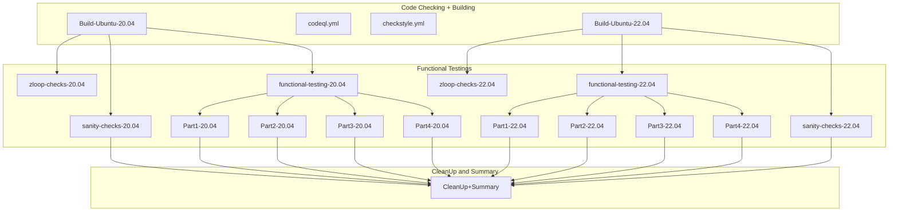

## The testings are done this way




1) build zfs modules for Ubuntu 20.04 and 22.04 (~15m)
2) 2x zloop test (~10m) + 2x sanity test (~25m)
3) 4x functional testings in parts 1..4 (each ~1h)
4) cleanup and create summary
   - content of summary depends on the results of the steps

When everything runs fine, the full run should be done in
about 2 hours.

The codeql.yml and checkstyle.yml are not part in this circle.

## Copilot Setup Workflow

The `copilot-setup.yml` workflow provides a comprehensive setup for the GitHub Copilot development environment.

### Purpose

Sets up all dependencies and tools required for Copilot to effectively work with the ZFS codebase:

- Core build dependencies (build-essential, autoconf, automake, etc.)
- ZFS-specific libraries and headers  
- Code quality tools (cppcheck, shellcheck, flake8)
- Optional full build validation

### Usage

**Manual Trigger**: Go to Actions → copilot-setup → Run workflow

**As Reusable Workflow**:
```yaml
jobs:
  setup:
    uses: ./.github/workflows/copilot-setup.yml
    with:
      validate_build: true
```

### Features

- **Fast Setup**: Core dependencies install in ~1-2 minutes
- **Full Validation**: Optional complete build cycle (~5-6 minutes total)  
- **Tool Verification**: Ensures all required tools are properly installed
- **Environment Summary**: Clear status reporting of setup completion

This ensures Copilot has a complete and validated environment for ZFS development work.
